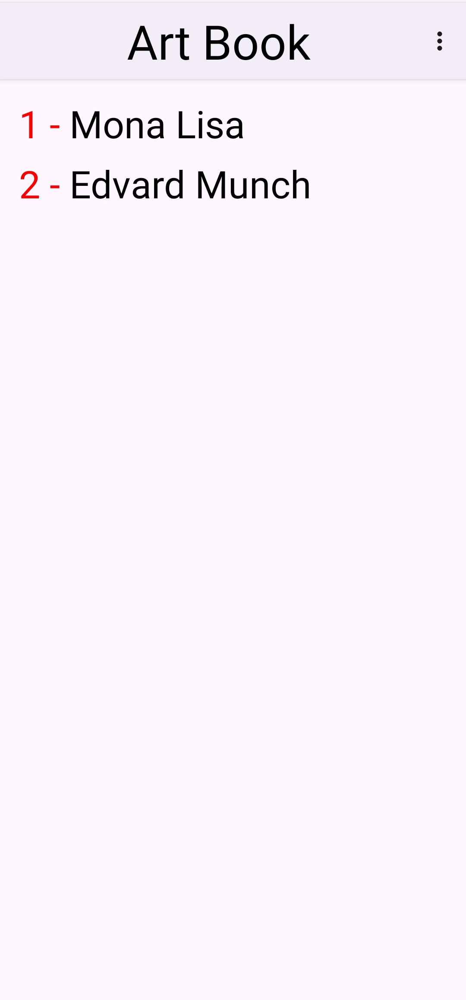
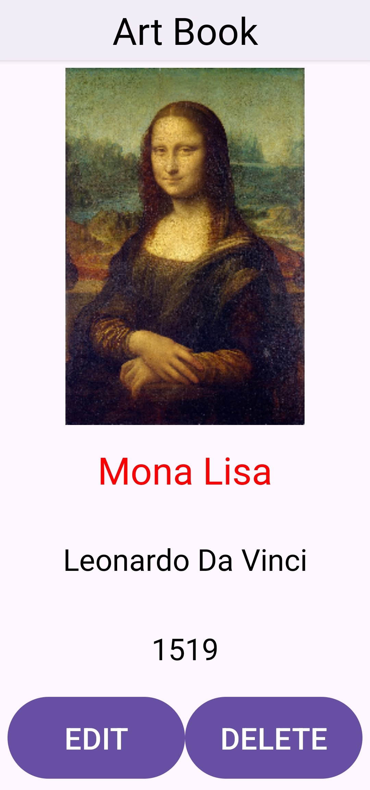
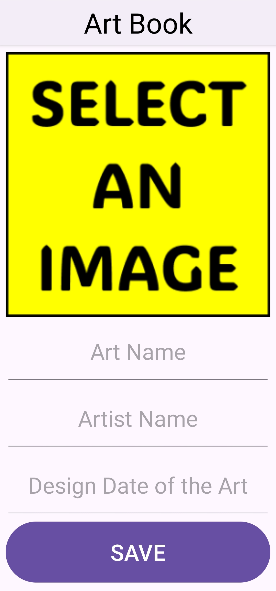

# Art Book (Android • Java)

A simple offline catalog app to save, browse, edit, and delete artworks on your device. Each entry stores a title, artist, date, and image; data is persisted locally in SQLite. Built with AndroidX, Material Design, RecyclerView, and ViewBinding.

## Overview

- List of artworks backed by a local SQLite table (no network required)
- Add new entries with image picker, edit existing ones, or delete
- Optimized image handling: scaling + compression before saving as BLOB
- Modern UX touches: Material components, edge‑to‑edge, custom action bar
- Permissions handled per-API level: Photo Picker on Android 13+ (no storage permission), legacy READ_EXTERNAL_STORAGE for older versions

## Features

- Browse artworks in a RecyclerView
- Tap to view details (image, title, artist, date)
- Add or edit entries; delete with confirmation dialog
- Image selection via:
  - Android 13+ (API 33+): System Photo Picker (ActivityResultContracts.PickVisualMedia)
  - Android 12L and below (API ≤32): Gallery with runtime permission

## Tech stack

- Language: Java 8
- Min SDK: 24
- Target/Compile SDK: 36
- Build system: Gradle (Android Gradle Plugin 8.13.1)
- Key libraries:
  - AndroidX AppCompat 1.7.1
  - Material Components 1.13.0
  - Activity 1.11.0
  - ConstraintLayout 2.2.1
  - GridLayout 1.1.0
  - ViewBinding enabled

You can confirm versions in `gradle/libs.versions.toml` and `app/build.gradle`.

## Project structure

- `app/src/main/java/com/receparslan/artbook/`
  - `MainActivity.java` — Loads data from SQLite, displays list via RecyclerView
  - `RecyclerAdapter.java` — Binds `Art` items to rows and handles click navigation
  - `DetailActivity.java` — Shows details, supports delete and edit navigation
  - `AddingActivity.java` — Add or edit an artwork, pick/scale/compress image, save to DB
  - `Art.java` — Simple model (id, name, artistName, date, image Bitmap)
- `app/src/main/AndroidManifest.xml` — Permissions and activities
- `app/src/main/res/` — Layouts, menus, drawables, and a custom `action_bar`

## Data model & storage

SQLite table (created on demand):

```sql
CREATE TABLE IF NOT EXISTS arts (
  id INTEGER PRIMARY KEY,
  name   VARCHAR,
  artist VARCHAR,
  date   VARCHAR,
  image  BLOB
);
```

- Images are scaled to a max dimension (e.g., 300px) and compressed (PNG) before storage to keep DB size reasonable.
- CRUD is performed with raw SQL (`SQLiteDatabase` + `SQLiteStatement`).

## Permissions & privacy

- Android 13+ (API 33+): Uses the system Photo Picker; no storage permissions are requested.
- Android 12L and below (API ≤32): Requests `READ_EXTERNAL_STORAGE` at runtime to open the gallery.

See `AndroidManifest.xml` for the conditional permission declaration and `AddingActivity` for the implementation.

## Build & run

### Option A: Android Studio

1. Open the root folder (`Art Book`) in Android Studio.
2. Let Gradle sync finish (it will download dependencies automatically).
3. Choose a device/emulator (API 24+), then Run ▶.

### Option B: Command line (Windows PowerShell)

```pwsh
# Build debug APK
.\gradlew assembleDebug

# (Optional) Install to a connected device/emulator
adb install -r .\app\build\outputs\apk\debug\app-debug.apk
```

If you don’t have `adb` on PATH, you can use the one inside your Android SDK (`platform-tools`).

## Usage

- Tap + (menu) to add a new artwork.
- Pick an image; enter title, artist, and date; Save.
- Tap an item in the list to view details. From details you can Edit or Delete.

## Screenshots

| List                                                               | Detail                                                                 | Add/Edit                                                              |
|--------------------------------------------------------------------|------------------------------------------------------------------------|-----------------------------------------------------------------------|
|  |  |  |

## Notes on implementation

- Edge-to-edge is enabled via `EdgeToEdge.enable(this)` and insets are applied to the root view.
- A custom action bar layout is used for a consistent look across activities.
- ViewBinding is enabled in Gradle and used across activities and the adapter for type-safe view access.

## Troubleshooting

- Build tools/SDK: Ensure you have Android SDK 36 installed in the SDK Manager.
- Gradle sync issues: Use a recent Android Studio version compatible with AGP 8.13.x.
- If images don’t appear after selection on older devices, verify the `READ_EXTERNAL_STORAGE` permission is granted (API ≤32).

## Roadmap / Next steps

- Migrate raw SQLite to Room for type-safety, migrations, and testability
- Add unit tests and UI tests (Espresso) for core flows
- Support dark theme and larger screen optimizations
- Export/import database or share entries
- Paging and search for large collections

## Contributing

Issues and pull requests are welcome. If you plan a larger change, consider opening an issue to discuss scope and approach.

## License

This project is licensed under the MIT License. See the `LICENSE` file for details.

---

Made with AndroidX + Material Design. Happy cataloging!
